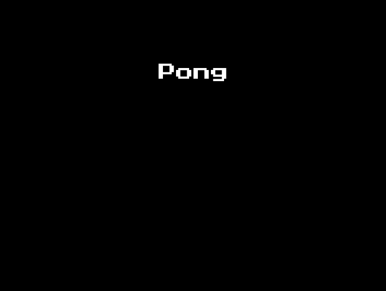

  <h1 align="center">🎮 Ping Pong Pygames 🎮</h1>


### Este é um projeto simples do famoso jogo Pong implementado em Python usando a biblioteca Pygame.




# Requisitos

### - Python 3.x 🐍
### - Pygame 🎮

# Instalação dos Pacotes 🔧

```bash
pip install -r requirements.txt
```

# Executando o jogo ▶️

```bash
python main.py
```

# Estrutura do Código 🏗️ 

### O código está dividido em dois arquivos principais:

##### - main.py: Este é o ponto de entrada para o jogo. Ele inicializa o jogo e entra no loop principal do jogo.
##### - pong_classes.py: Este arquivo define as classes principais usadas no jogo, que são Paddle, Ball e Game.

## Paddle

##### A classe Paddle representa as raquetes do jogador. Ela é derivada da classe Rect do Pygame, que fornece funcionalidades básicas para desenhar retângulos e detectar colisões.


## Ball
##### A classe Ball representa a bola do jogo. Assim como a classe Paddle, ela é derivada da classe Rect. Ela também tem propriedades adicionais para controlar a direção da bola.


## Game
##### A classe Game representa o estado geral do jogo. Ela contém a lógica principal do jogo, incluindo o loop do jogo, a detecção de colisões, o controle de pontuação e a manipulação de eventos.

# Controles do Jogo 🕹️ 
##### Os controles do jogo são os seguintes:

| Jogador 1 | Jogador 2 |
| --- | --- |
| W: Mover para cima | Seta para cima: Mover para cima |
| S: Mover para baixo | Seta para baixo: Mover para baixo |
| A: Mover para a esquerda | Seta para a esquerda: Mover para a esquerda |
| D: Mover para a direita | Seta para a direita: Mover para a direita |

# Som 🔊
##### O jogo inclui música de fundo e efeitos sonoros para a colisão da bola com as raquetes e para quando um jogador marca um ponto.

## Contribua :)

1 - Fork it

2 - Cria sua feature branch (git checkout -b my-new-feature)

3 - Commit suas mudanças (git commit -am "Added some feature")

4 - Push na sua branch (git push origin my-new-feature)

5 - Crie novo Pull Request